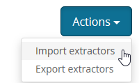

# Ubiquiti EdgeRouter Lite (ERL3) Grok Extractors

## Overview
Grok extractors for the Ubiquiti EdgeRouter Lite (ERL3)

## ERL3 configuration
Login to the ERL3 web interface and click *System*. Under the box titled *System Log*, enter the hostname and port of the Graylog server (in the format `ip:port`), and choose the log level (e.g., debug). Be sure to click *Save* at the bottom of the page.  

## Graylog configuration
Create a new input of type *Syslog UDP*. Be sure to use whatever port you're using on the ERL3 (e.g., 8515).
Then, click *Manage extractors*, then click on *Actions*, then *Import extractors*.  

Copy/paste the raw JSON [here](https://raw.githubusercontent.com/loganmarchione/graylog-edgerouter-lite/master/erl3-grok.json) into the box and click *Add extractors to input*.
